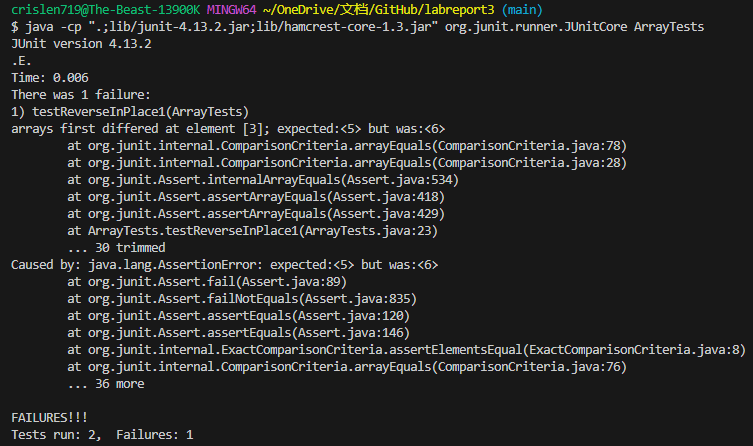
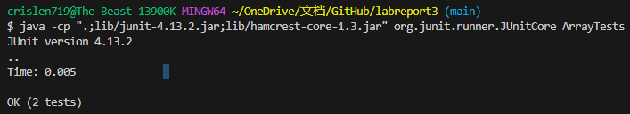

# Lab Report 3 - Bugs and Commands <br />
### Part 1 - Bugs
One bug program we chose for this lab report would be reverseInPlace in ArrayTests.java. The code before the change and has bug is shown below:

```
static void reverseInPlace(int[] arr) {
    for(int i = 0; i < arr.length; i += 1) {
      arr[i] = arr[arr.length - i - 1];
    }
  }
```
<br />
A failure-inducing input for the buggy program is shown below:

```
@Test 
	public void testReverseInPlace1() {
    int[] input1 = {3, 4, 5, 6, 7, 8};
    ArrayExamples.reverseInPlace(input1);
    assertArrayEquals(new int[]{8, 7, 6, 5, 4, 3}, input1);
	}
```

<br />
An input that doesn't induce a failure is shown below:

```
@Test 
	public void testReverseInPlace() {
    int[] input1 = { 3 };
    ArrayExamples.reverseInPlace(input1);
    assertArrayEquals(new int[]{ 3 }, input1);
	}
```
<br />

The screenshot of the symptom as the output of running the test by using JUnit is shown below:
 <br />

The bug program we chose for this lab report after change and fix the bug is shown below:

```
  static void reverseInPlace(int[] arr) {
    int temp;
    for(int i = 0; i < arr.length/2; i += 1) {
      temp = arr[i];
      arr[i] = arr[arr.length - i - 1];
      arr[arr.length - i - 1] = temp;
    }
  }
```

The output showing the test cases are passed by running JUnit is shown in the screenshot:
 <br />
The bug in this program is it only reverses the first half of the array. For example, if I have an array that is [1, 2, 3, 4, 5], the for loop will run 5 times because our array size is 5. The first three loops will run fin and our array will become [5, 4, 3, 4, 5]. As we run the for loop for the fourth time, we can see the second index and the fourth index in the array are the same, so the index does not change, and this also happens in the fifth for loop. our array after we finish the for loop will be [5, 4, 3, 4, 5].
To fix this bug, we declare an int variable temp to store the index in the array, and we only run the for loop for half of the size of the array times. for example, if we have an array that is [1, 2, 3, 4, 5], for the first for loop, the temp will store the first index in the array which is 1, and the first index gets changed to the last index, and the last index will get change to the temp. Now our array after the first for loop is [5, 2, 3, 4, 1]. So on, our array after the second for loop stores 2 in temp, the second index in the array changes to the fourth index in the array, and the fourth index changes to temp. So our array after the second for loop is [5, 4, 3, 2, 1], Program end.
<br />

### Part 2 - Researching Commands
By searching "find command-line options" in Google, we find a website that talks about the find command-line option and the URL of the website is https://man7.org/linux/man-pages/man1/find.1.html
<br />
We try -type command option for the find command. -type command can be used for searching and locating files and directories within a specified directory hierarchy.<br />
We can use -type d to search all the directories inside a directory. For example, if I type find technical/ -type d, the terminal will output all the directories inside technical. The output is shown below:
```
$ find technical/ -type d
technical/
technical/911report
technical/biomed
technical/government
technical/government/About_LSC
technical/government/Alcohol_Problems
technical/government/Env_Prot_Agen
technical/government/Gen_Account_Office
technical/government/Media
technical/government/Post_Rate_Comm
technical/plos
```
We can use -type f to search all the files inside a directory. For example, if I type find technical/911report/  -type f, the terminal will output all the files inside technical/911report. The output is shown below:
```
$ find technical/911report/  -type f
technical/911report/chapter-1.txt
technical/911report/chapter-10.txt
technical/911report/chapter-11.txt
technical/911report/chapter-12.txt
technical/911report/chapter-13.1.txt
technical/911report/chapter-13.2.txt
technical/911report/chapter-13.3.txt
technical/911report/chapter-13.4.txt
technical/911report/chapter-13.5.txt
technical/911report/chapter-2.txt
technical/911report/chapter-3.txt
technical/911report/chapter-5.txt
technical/911report/chapter-6.txt
technical/911report/chapter-7.txt
technical/911report/chapter-8.txt
technical/911report/chapter-9.txt
technical/911report/preface.txt
```
<br />
We tried -size command option for the find command. -size command can be used to search for files based on their size.<br />
We can use -size +300k to search all the files that have a size larger than 300k inside a directory. For example, if I type find technical/ -size +300k, the terminal will output all the files that have a size larger than 300k inside technical/. The output is shown below:

```
$ find technical/ -size +300k
technical/government/Gen_Account_Office/d01591sp.txt
technical/government/Gen_Account_Office/Statements_Feb28-1997_volume.txt
```

We can use -size +1c to search if a file has a size larger than 1 byte. For example, If I type find technical/911report/chapter-1.txt -size +1c, If the terminal output the path of the file, that means the file size is larger than 1 byte, the output is shown below:
```
$ find technical/911report/chapter-1.txt -size +1c
technical/911report/chapter-1.txt
```

If we use -size +1M to search a file and nothing is output, that means the file size is smaller than 1M. For example, if I type find technical/911report/chapter-1.txt -size +1M, nothing will be output because file chapter-1.txt size is least than 1M, the output is shown below:
```
$ find technical/911report/chapter-1.txt -size +1M

```
<br />

We tried -name command option for the find command. -name command can be used to search for files or directories based on their names. <br />
We can use -type d -name "d*" to search all the directories that have a name start with the letter d inside a directory. For example, if I type find technical/ -type d -name "9*", the terminal will output the directories that have a name start with 9. The output is shown below:
```
$ find technical/  -name "9*"
technical/911report
```

We can use -type f -name "chapter-1*" to search all the files that have a name start with chapter-1 inside a directory. For example, if I type find technical/ -type f -name "chapter-1*", the terminal will output the files that have a name start with chapter-1. The output is shown below:
```
$ find technical/ -type f -name "chapter-1*"
technical/911report/chapter-1.txt
technical/911report/chapter-10.txt
technical/911report/chapter-11.txt
technical/911report/chapter-12.txt
technical/911report/chapter-13.1.txt
technical/911report/chapter-13.2.txt
technical/911report/chapter-13.3.txt
technical/911report/chapter-13.4.txt
technical/911report/chapter-13.5.txt
```

We tried -mmin n command option for search files or directories was last modified less than, more than, or exactly n minutes ago. <br />
We can use find -type d -mmin -100 to search all the directories that were modified less than 100 minutes ago. Let's say I add a new folder name Hello in technical/, and I type find technical/ -type d -mmin -100, the terminal will output the directories that I modified less than 100 minutes ago. The output is show below:
```
$ find technical/ -type d -mmin -100
technical/
technical/Hello
```

We can use find -type f -mmin -100 to search all the files that were modified less than 100 minutes ago. Let's say I add a new line Hello inside technical/911report/chapter-12.txt, and I type find technical/ -type f -mmin -100, the terminal will output the files that I modified less than 100 minutes ago. The output is shown below:
```
$ find technical/ -type f -mmin -100
technical/911report/chapter-12.txt
```
